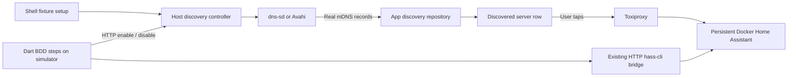

# Per-scenario Home Assistant discovery: design

Date: 2026-10-03
Status: Agreed direction; implementation planned, native discovery not yet verified.

This extends the recovered local E2E workflow on `codex/local-e2e-recovery`.
[Current testing workflow](../../testing.md) remains authoritative for installed
Patrol, the persistent Docker fixture, hass-cli administration and Toxiproxy.
Implementation plan: [E2E server discovery](../plans/2026-10-03-e2e-server-discovery.md).

## Chosen approach and purpose

Use a small **host discovery controller** to own one native mDNS publisher:
`dns-sd` on macOS, `avahi-publish-service` on Linux. Dart BDD steps call its HTTP
API to register or withdraw the test advertisement. The app uses its real
discovery repository, displays the result, and connects to the existing Docker
Home Assistant through Toxiproxy.

This controller runs beside the native publisher because the simulator cannot
spawn host commands and the Docker bridge cannot directly invoke host Bonjour
or Avahi. Its only job is advertising the fixture. Shell scripts own startup and
shutdown; the installed Patrol CLI continues to own test execution. A separate
Docker advertiser is not selected: Docker-to-host multicast would introduce
another network boundary that must itself be proven.

## Constraints

- iOS Simulator on macOS is the primary acceptance platform.
- Linux/Android discovery is supported only after a real app/emulator probe passes.
- Use the installed Patrol CLI; keep executable lifecycle scripts in POSIX shell.
- Keep BDD source and generated tests in `app/integration_test/`.
- Preserve Compose project `homeassistant-test` and volume `homeassistant-test_ha_config`.
- Keep the hass-cli bridge for HA administration and Toxiproxy for connection faults.
- Advertise `_home-assistant._tcp.local.`; pass `_home-assistant._tcp` and `local.` separately to native publisher CLIs.
- Advertised `internal_url` equals `E2E_APP_SERVER_URL`, including the mapped proxy port.
- Run scenarios sequentially; own at most one fixture advertisement.
- Discovery is disabled before and after every scenario, including cold phases.
- No discovery provider override, canned result list, native network toggle or new test-runner CLI.

## Fixture control contract

Implement the host controller with locally installed Python 3.11+ and its standard
library. Keep daemon code under `tool/e2e/discovery/`; it is a fixture service,
not an alternative test runner. No Python packages or automatic tool installation
are needed. Linux additionally requires Avahi's publisher and a running daemon;
macOS uses the system `dns-sd`.

Default HTTP port is `18535`, configurable as `E2E_DISCOVERY_PORT` and distinct
from all existing fixture ports. Bind to host loopback. Add `E2E_DEVICE_HOST`
(default `127.0.0.1`) for device-facing HTTP endpoints; `10.0.2.2` is the Android
Emulator candidate to verify. Host setup still performs readiness checks against
`127.0.0.1`. HTTP reachability does not establish multicast reachability.

Setup writes a private controller config under ignored `.dart_tool/e2e/discovery/`
and adds `E2E_DISCOVERY_CONTROL_URL` and `E2E_DISCOVERY_CONTROL_TOKEN` to
`app/.patrol.env`. The controller token is independent of HA credentials, generated
with 32 random bytes, and retained only in owner-readable files. Bearer
authentication is required for every endpoint. Never log either credential.

The API exposes only:

| Request | Meaning |
| --- | --- |
| `GET /health` | Confirm controller identity/run ID and readiness. |
| `GET /advertisement` | Return actual owned publisher state. |
| `PUT /advertisement` with `{"enabled":true,"scenario_id":"scenario1","name":"Hommie E2E"}` | Register this scenario's fixture. |
| `PUT /advertisement` with `{"enabled":false}` | Withdraw the controller's fixture, including a prior interrupted scenario. |

Advertisement responses contain `enabled`, `run_id`, `scenario_id`, `name`,
`service_name`, `uuid`, and `internal_url`; nullable scenario/name/service fields
are null while disabled. Repeat enable with identical input and repeat disable
are idempotent. An attempt to replace an enabled advertisement without disabling
it first returns HTTP `409`. Reject malformed/unknown fields with `400`, invalid
credentials with `401`, and publisher failure with `503`.

The config fixes run ID, proxy URL/port and HA version. HTTP callers cannot choose
commands, executable paths, arbitrary endpoints or TXT fields. Accept display
names of 1–63 UTF-8 bytes without control characters and scenario IDs matching
`^[a-zA-Z0-9_-]+$`. Publisher arguments are arrays with `shell=False`.

Use a DNS service instance `hommie-e2e-` plus the first 12 hex characters of
SHA-256 of the run ID. `location_name` is the BDD display name. Publish a stable
UUIDv5 using `uuid.NAMESPACE_URL` and `hommie-e2e:<run_id>`, the real fixture HA
version, and the proxy `internal_url`.
The fixture advertisement represents the Docker HA instance but has its own
test identity; it does not mutate HA's persistent identity or configuration.

Enable succeeds only after the native publisher acknowledges the exact service
instance within 5 seconds. A spawned process is insufficient. Name collision,
auto-renaming, early exit or registration timeout fails and stops the child.
Disable succeeds only after that exact owned publisher has exited within
5 seconds; terminate, then kill only that child if necessary. HTTP operations
have a 10-second Dart deadline. Status detects a publisher that exited after
registration instead of returning the last requested state.

## Lifecycle and interrupted tests

Setup starts the controller disabled, checks its authenticated identity, and
publishes the dotenv file only after readiness. Repeated setup retires the
previous owned controller before starting a new run. Cleanup withdraws the
advertisement and stops the owned controller before stopping Compose services.
Never kill a process solely because it occupies the configured port.

The Dart harness registers withdrawal before issuing discovery mutations, then
disables any advertisement left by a prior scenario before starting the next
one. Teardown still attempts HA/proxy/app cleanup if withdrawal fails, retains
the primary test failure and reports cleanup failure. Withdrawing discovery does
not change Toxiproxy; cold verification must still start with its route disabled.

Normal exceptions and test failures run teardown. A killed app cannot run Dart
teardown: its advertisement can remain until the next scenario, setup or explicit
cleanup. No background lease/heartbeat service is introduced. Host controller
shutdown must stop its child; setup detects leftover owned state after a host
controller crash and fails or reconciles verified ownership, never killing
unrelated publishers. Preserve enough private process identity to distinguish
an owned leftover from a reused PID.

## Real discovery and fresh scans

The repository supplies `_home-assistant._tcp`; the installed `multicast_dns`
0.3.3+1 encoder and response resolver append/normalize the local domain. This is
not a confirmed query bug. Pin the emitted DNS question to the labels
`_home-assistant`, `_tcp`, `local`, followed by one root terminator and PTR type
`12`. Keep the current query spelling unless a failing regression proves a
change is necessary; this encoder does not safely normalize a trailing dot.
Keep the production transport and add only a client-factory seam for unit tests.
Split each TXT field at its first `=` so valid display names containing `=`
survive parsing, and test the fixture name, UUID, version and internal URL.

The repository caches results for 15 seconds and the controller schedules scans
every 10 seconds. Add a real refresh action available for both empty and populated
lists. A force refresh waits for any running scan to finish, then invalidates the
cache and performs one fresh scan; periodic ticks cannot overlap it. Show a
loading state during that fresh scan and distinguish successful completion from
an error. Disposal prevents a late scan from writing controller state.

Absence assertions must follow a successfully completed fresh scan. They match
the fixture's exact name and proxy URL, allow unrelated discovered HA servers,
and fail on scan errors. After withdrawal, bounded repeated fresh scans may be
needed for cached DNS records to disappear; the deadline is 60 seconds. Neither
an empty widget during loading nor a fixed sleep proves absence.

## BDD coverage and acceptance

Add three scenarios using semantic fixture steps:

1. Enable discovery as `Hommie E2E`, open discovery, find the row with the exact
   proxy URL, tap it, reach the real HA authentication form, sign in and reach home.
2. Keep the fixture undiscoverable, complete a fresh successful scan, verify its
   row is absent, and use manual entry to reach authentication against the same HA.
3. Discover the fixture, withdraw it while the discovery page is open, refresh,
   and verify the row disappears after a successful fresh scan.

First prove real publisher → production discovery → authentication on macOS/iOS
before extending the fixture tooling. Handle the local-network prompt through
Patrol when present; verify platform declarations, adding only required entries.
Then run the generated BDD cases positive → negative and negative → positive,
repeat the ordinary suite, and preserve the existing cold-launch acceptance.
Verify publisher state is disabled and owned processes/HA resources are cleaned.

Run the same probe on a Linux host with Avahi and Android Emulator before calling
that lane supported. Record emulator version, network configuration, raw Dart
mDNS receipt, TXT contents, and HTTP reachability separately. If multicast does
not reach the app, record the blocker and revise the transport/network design;
do not mark a mocked or skipped test as discovery acceptance.

## Evidence and verification limits

Source inspection confirms the library's local-domain normalization, the cache
and scan intervals, and refresh being available only in empty/error states.
`Info.plist` already has
a local-network usage description; Android declares multicast-state permission.
Neither is evidence of a passing native discovery test. This design adds no
platform package-management migration.

Home Assistant documents the service name and discovery-to-OAuth flow in
[native app setup](https://developers.home-assistant.io/docs/api/native-app-integration/setup/).
Apple describes asynchronous registration, collision renaming and withdrawal in
[DNS-SD registration](https://developer.apple.com/library/archive/documentation/Networking/Conceptual/dns_discovery_api/Articles/registering.html).
[Avahi](https://avahi.org/) supplies Linux mDNS/DNS-SD publishing. Android documents
Network Service Discovery availability after Emulator 36.5 in
[emulator networking](https://developer.android.com/studio/run/emulator-networking);
that capability alone does not prove host multicast reaches Hommie's raw Dart
client. Both native discovery lanes remain unverified at plan-writing time.
