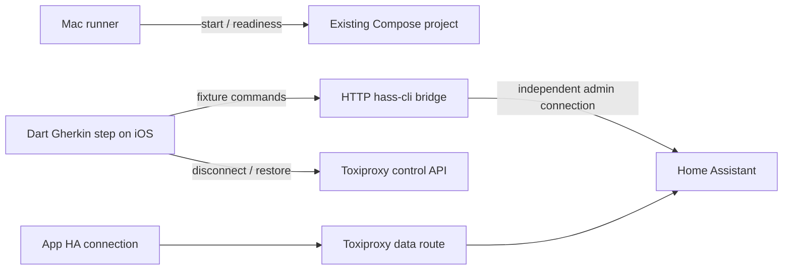

# Local end-to-end testing

Run from the repository root on a Mac with Docker Desktop, Xcode and an installed iPhone Simulator runtime, Flutter 3.47+ and Dart 3.13+:

```sh
./scripts/e2e.sh
./scripts/e2e.sh --target offline_banner
./scripts/e2e.sh --target cold_start
./scripts/e2e.sh --target authorization --tags revocation
./scripts/e2e.sh --device 'iPhone 17' --repeat 3
./scripts/e2e.sh --watch
./scripts/e2e.sh --develop --target areas
```

An absolute invocation works from any directory:

```sh
/Users/hurricane/Development/hommie/scripts/e2e.sh --target offline_banner
```

The default suite runs authorization, areas, connection loss/recovery, and the paired cold launch. The runner selects an available booted iPhone Simulator first, otherwise the newest available runtime; `--device` accepts its name or UDID. Physical devices are excluded. iOS is the primary local lane. Android remains a manual alternative using the same bridge and proxy endpoints; there is no native network-toggle fault lane.

The runner starts missing services, checks authenticated HA/bridge/fixture readiness, reconciles owned leftovers, generates BDD tests, and invokes the pinned Patrol CLI 4.8.0 with Patrol 4.10.0. A global CLI installation is unnecessary. Tests stay in `app/integration_test`; `patrol.test_directory` points there. Feature files and handwritten steps are the sources; commit regenerated `_test.dart` files. Write each Gherkin tag on its own line for this BDD generator.

VS Code provides `patrol: run tests` and `patrol: watch tests`. Repeat executes exactly N runs and stops on the first failure. Watch serializes runs and coalesces edits to source, feature/step/helper files and relevant fixture/build configuration; generated files and build/artifact directories are ignored. Develop accepts one ordinary target, with the same fixture setup and cleanup. Cold phases are internal and cannot be selected separately. Boolean tag expressions select `cold_start` as a whole pair; `cold_seed` and `cold_verify` are reserved. The default whole-run deadline is 1800 seconds, configurable with `--timeout-seconds`.

## Persistent fixtures and control

The existing Compose project is `homeassistant-test`. HA uses the named `/config` volume `homeassistant-test_ha_config`. Services stay running between scenarios; test cleanup removes only owned tokens and namespaced areas. Management credentials, baseline areas, containers and configuration survive repeated runs.



The simulator never invokes Docker. A semantic `client loses connection` step disables the `hommie_ha` proxy route; all app HA HTTP/WebSocket traffic uses that route. The bridge reaches HA directly and remains usable for fixture checks, live token revocation and cleanup during outages. This models losing reachability to HA, not disabling all device internet or testing OS network indicators.

Cold launch is a real two-process test: seed persists session, selected kitchen-light tile and synced database; the host checks a non-secret checkpoint, terminates the app, verifies it stopped, and disables the proxy before launching verify. Both phases use `--no-uninstall`, with native isolation/permission clearing disabled. Verify checks a different PID and retained SQLite/Keychain state without login or reseeding, then reconnects and removes the owned session. An internal recovery target clears actual app-owned SQLite/Keychain data if native execution was killed before Dart teardown.

## Backend operations and recovery

```sh
./scripts/e2e.sh backend start
./scripts/e2e.sh smoke
./scripts/e2e.sh backend stop
./scripts/e2e.sh backend migrate-config
./scripts/e2e.sh backend reset --confirm-test-data-reset
```

Stop preserves the volume and credentials. Migration copies an old container-writable `/config` into the named volume after taking a private configuration backup and rollback image; it verifies the copied auth state. Keep `.dart_tool/e2e/config-backup-*`, the rollback image and `volume-migration.json` until you intentionally retire rollback. Reset explicitly destroys only this test fixture's configuration and derived credentials; it is never automatic.

The runner holds `.dart_tool/e2e/run.lock` for the whole command. A second live invocation fails before Compose/Patrol starts. The stable lock file remains after release; its `released` status is normal. A dead previous owner is detected and the next run restores the route and reconciles private ownership journals. Ambiguous OAuth ownership fails with the journal retained rather than deleting unrelated sessions. SIGINT/SIGTERM and deadlines terminate owned child processes before recovery. A failed/interrupted test keeps its original nonzero status even if diagnostics also fail.

Ports default to HA 8123, bridge 3000, data proxy 18124, proxy control 18474. Set `E2E_HA_PORT`, `E2E_BRIDGE_PORT`, `E2E_PROXY_PORT`, `E2E_CONTROL_PORT` together when needed; each must be distinct. Credentials live in ignored owner-only `app/.patrol.env` and `docker/hass_init_conf/.env`. Don't publish them.

## Evidence and troubleshooting

Each invocation writes sanitized `artifacts/e2e/<run-id>/runner.log`, service logs, metadata (device, versions, stage durations, exit/cleanup errors, cold PID proof), and exported native summaries/text diagnostics. Generated define files are private and removed after cleanup. Known passwords/tokens, JWTs and credential fields are scrubbed before logs are saved.

Patrol's native SDK records typed credentials inside `.xcresult`. Exact original bundles remain **private** in ignored `app/build/ios_results_*.xcresult`; artifact metadata records the exact paths from this invocation. Shareable exports contain sanitized text; binary native attachments are not automatically copied because they may include credential fields. Flutter failure images and interruption screenshots are retained privately under `.dart_tool/e2e/screenshots/<run-id>`; metadata records their paths. Inspect originals locally when investigating an image or native failure, and redact any screenshot before sharing it.

If startup fails, check Docker Desktop, the four ports and Xcode simulator availability. For bridge/HA failures inspect sanitized backend logs and the named volume; do not reset credentials to work around readiness failures. The independent `smoke` command proves a real WebSocket outage, continued CLI access and route recovery without building the app. Unit regressions run with `flutter test app/test/e2e`; generate features with `cd app && dart run build_runner build --delete-conflicting-outputs`.

These rails are local. No recurring automation or CI schedule is installed.
