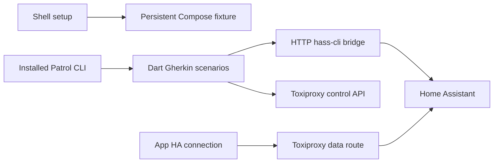

# End-to-end testing

Install Flutter/Dart, Xcode with an iPhone Simulator runtime, Docker Desktop,
[Patrol CLI](https://pub.dev/packages/patrol_cli), and `jq` locally. The verified
baseline is Flutter 3.47+, Dart 3.13+, Patrol CLI 4.8.0 and Patrol 4.10.0. Run
`patrol doctor` to check the native toolchain. The repository does not install,
activate, or resolve a separate CLI copy.

Prepare the persistent fixture from the repository root:

```sh
./scripts/setup_test_env.sh
```

Then run the installed CLI from `app/`, selecting an iPhone Simulator through
Patrol's device option or prompt:

```sh
cd app
patrol test --no-uninstall
```

Patrol reads the generated, ignored `app/.patrol.env` automatically. Keep
`--no-uninstall` so a subsequent test can recover an interrupted scenario's
ownership journal from the app sandbox. Scenarios explicitly clear actual
SQLite/Keychain state; uninstall is not the cleanup mechanism.

Use Patrol's own commands, target/tag filters, device selection and development
workflow. See [Patrol documentation](https://patrol.leancode.co/documentation).
There is no repository test-runner CLI, custom watch command, or private pub
cache. The VS Code `patrol: run tests` task also calls `patrol` directly.

BDD source remains in `app/integration_test/` with handwritten steps and helpers.
Generate tests using build_runner from `app/`; commit the generated `_test.dart`
files. Write each Gherkin tag on its own line. Patrol's runtime runner discovers
tests; cold phases and the internal recovery scenario are skipped in ordinary
runs. iOS is the primary local platform; Android can use the same proxy/bridge
with emulator-reachable endpoints in `.patrol.env`.

## Persistent fixture

The shell setup starts only missing services in `homeassistant-test`, checks HA
management authentication and bridge health, ensures the fixture areas and
`light.kitchen_light`, and reconciles the `hommie_ha` Toxiproxy route. It writes
credentials/endpoints/run ID to owner-only `.patrol.env`. `curl`, `jq`, Docker
Compose and the already-installed Patrol are the only host tools it uses.

HA `/config` remains in `homeassistant-test_ha_config`. Original areas, management
credentials and container state survive ordinary repeated runs. If an old
container has not been migrated to this volume, setup fails without replacing
it. The completed migration's private config backup, rollback image and
`.dart_tool/e2e/volume-migration.json` remain available; automatic migration/reset
commands were removed with the custom runner.



The simulator never invokes Docker. Semantic loss/recovery steps disable/enable
the proxy route. The independent hass-cli bridge reaches HA directly, so token
revocation, fixture verification and cleanup stay usable during app outages.
This models losing reachability to HA; no native Wi-Fi/cellular toggle is used.

Scenario teardown restores the proxy, removes exact owned tokens/areas and
clears actual SQLite/Keychain data. A small journal in the app's support directory
records baseline ownership before mutations. If native execution is interrupted,
the next ordinary run restores the route and reconciles pending journals before
starting a scenario. Ambiguous OAuth ownership fails with the journal retained.
Run scenarios sequentially against this shared fixture.

Stop services without deleting the volume or credentials:

```sh
./scripts/cleanup_test_env.sh
```

Ports default to 8123 (HA), 3000 (bridge), 18124 (app proxy), 18474 (proxy control).
`E2E_HA_PORT`, `E2E_BRIDGE_PORT`, `E2E_PROXY_PORT`, `E2E_CONTROL_PORT` can override
host mappings; each must be distinct. Stop services before changing mappings.

Fixture YAML merges preserve helpers/lights and unrelated `!include` tags.
Duplicate keys, fixture-name collisions and includes directly under
`input_boolean` or `light` fail before writing. First-time serialization removes
comments; retain the original configuration backup.

## Cold launch

A real cold launch needs host actions between two app processes. The narrow
`scripts/test_cold_start.sh` script calls the installed Patrol twice, preserving
the app, terminating seed, disabling the proxy before verify, and checking the
same run's checkpoint with different process IDs. Pass an already booted iPhone
Simulator UDID as its sole argument. There are no alternate target/device/filter
options. Checkpoint evidence is under ignored `.dart_tool/cold-start/`.

Verify reads persisted SQLite/Keychain without login or reseeding, restores the
connection and cleans up the owned seed session. Shell exit traps restore the
route on failure/interruption. Pending journal recovery occurs on the next
ordinary Patrol run if a process was killed before teardown.

## Diagnostics

Use Patrol's console output and native result paths. The custom artifact
exporter has been removed. Original `.xcresult` diagnostics can contain typed
credentials and must remain private. Flutter failure images remain inside the
simulator app support directory. Inspect and redact evidence before sharing it.

The original recovery baseline passed three complete iOS suites (21 native
executions). Those historical results are recorded in the recovery plan. Current
verification after simplification is recorded separately there. No schedule or
CI automation is installed.
